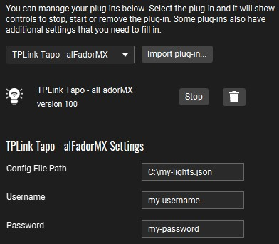

# TP-Link Tapo

Control TPL-Link Tapo devices through [Touch Portal](https://www.touch-portal.com/).

## Features

- **Settings:**
    - `Config File Path`            - File Path to Configuration File
    - `Username`                    - Username used to connect to TOPO light
    - `Password`                    - Password used to connect to TOPO light

- **Actions**
    - `On / Off`                    - Turn Device **on** or **off**
    - `Toggle`                      - Turns **on** or **off** a device accordingly
    - `Set Set Brightnessness`              - Set **Set Brightnessness** and turns **on** the device
    - `Set Color`                   - Sets the **Color** and turns **on** the device
    - `Set Color Temperature`       - Sets the **Color Temperature** and turns **on** the device
    - `Set Color and Set Brightnessness`    - Sets the **Color** and **Set Brightnessness** and turns **on** the device

## Supported devices and actions
| Device | Action                                                                                                           |
| ------ | ---------------------------------------------------------------------------------------------------------------- |
| `L510` | `On / Off`, `Toggle`, `Set Brightness`                                                                           |
| `L520` | `On / Off`, `Toggle`, `Set Brightness`                                                                           |
| `L610` | `On / Off`, `Toggle`, `Set Brightness`                                                                           |
| `L530` | `On / Off`, `Toggle`, `Set Brightness`, `Set Color`, `Set Color Temperature`, `Set Color and Set Brightnessness` |
| `L630` | `On / Off`, `Toggle`, `Set Brightness`, `Set Color`, `Set Color Temperature`, `Set Color and Set Brightnessness` |

## Installation

As with all plugins, this requires the Touch Portal Pro version to function. Follow this [Import a Touch Portal plug-in (.tpp)](https://www.touch-portal.com/blog/post/tutorials/import-plugin-guide.php) tutorial.

To configure the plugin you need three things: a config file, your TP-Link username and your TP-Link password.

The config file should be stored in your system and has the following format:

```YAML
# YAML Configuration file for TP-Link Tapo
# Group lights by supported types
L510:
  - name: "Light #1"  # Give your lights a name
    ip: 127.0.0.1     # And set their IP address
  - name: "Light #2"
    ip: 127.0.0.2

L520:
  - name: "Light #1"  # Beware! name acts as an ID, so this Light information will replace the one above it
    ip: 127.0.0.3
  - name: "Light #4"
    ip: 127.0.0.4

L610:
  - name: "Light #5"
    ip: 127.0.0.5
  - name: "Light #6"
    ip: 127.0.0.6

L530:
  - name: "Light #7"
    ip: 127.0.0.7
  - name: "Light #8"
    ip: 127.0.0.8

L630:
  - name: "Light #9"
    ip: 127.0.0.9
  - name: "Light #10"
    ip: 127.0.0.410

L1000:
  - name: "Light #11"
    ip: 127.0.0.11
  - name: "Light #12"
    ip: 127.0.0.12
```

It is not mandatory to include all light types in the file, making this example a completely valid one:
```YAML
L510:
  - name: "Light #1"
    ip: 127.0.0.1
```

One your input file edited, just get it's path and set it into the configuration as shown below. Don't forget to include your TP-Link username and password.



## Want to contribute?

First off, thanks for taking the time to contribute! ❤️. Read the guideliness and setup environment instructions in our [CONTRIBUTING](https://github.com/alfadormx/touchportal.plugin.tplink-tapo/blob/main/CONTRIBUTING.md) document.

## Acknowledgements
- [tapo](https://github.com/mihai-dinculescu/tapo)
- [TouchPortal-API](https://github.com/KillerBOSS2019/TouchPortal-API)

## License

The content of this project itself is licensed under the [GPL-3.0 license](https://www.gnu.org/licenses/gpl-3.0.html).